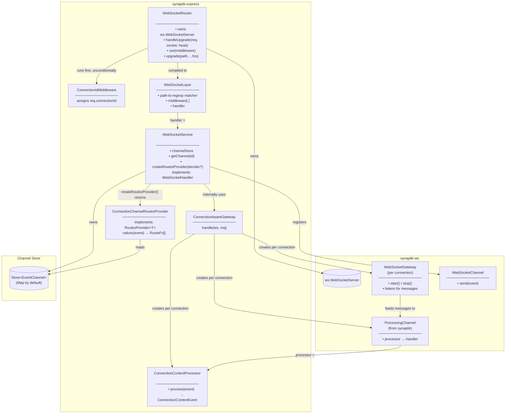
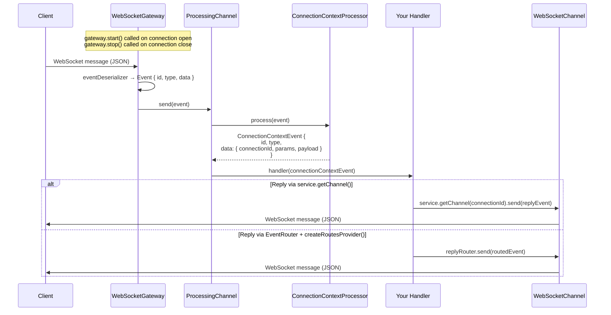
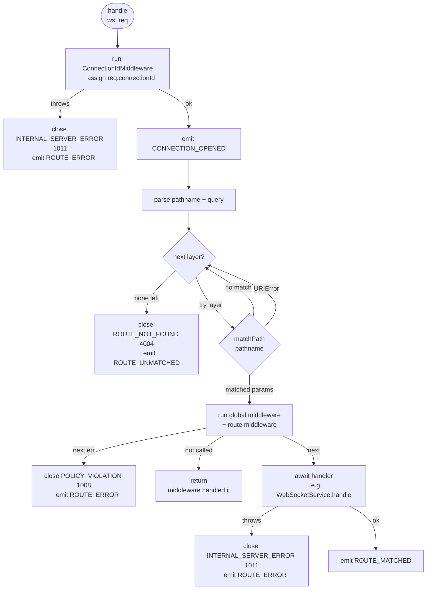

# WebSocket Transport

The WebSocket module provides a complete server-side WebSocket transport for `@sektek/synaptik-express`. It handles HTTP upgrade negotiation, connection lifecycle, URL-based routing, middleware, and event-driven message dispatch — all wired into the synaptik event pipeline.

The module is split along one deliberate seam: `WebSocketRouter` owns everything about the raw WebSocket connection (the upgrade handshake, URL routing, middleware, `connectionId` assignment) and has **no knowledge of Synaptik** — it's modeled on Express's `Router`, and is intended to be extractable into standalone WebSocket-for-Express utilities with no Synaptik dependency. `WebSocketService` is the bridge into Synaptik: it satisfies the router's own `WebSocketHandler` interface, so it's registered as an ordinary terminal handler on a route, and everything it owns (the channel store, outbound routing) is Synaptik-specific.

---

## Architecture



---

## Connection Lifecycle

```mermaid
sequenceDiagram
    participant Client
    participant HTTPServer as http.Server
    participant Router as WebSocketRouter
    participant IdMw as ConnectionIdMiddleware
    participant Layer as WebSocketLayer
    participant Service as WebSocketService
    participant Store as Store&lt;EventChannel&gt;

    Client->>HTTPServer: HTTP GET (Upgrade: websocket)

    alt { server } attach mode
        HTTPServer->>Router: internal upgrade handling
    else handleUpgrade() attach mode
        HTTPServer->>Router: handleUpgrade(req, socket, head)
    end

    Router->>IdMw: handle(ws, req, next)
    IdMw-->>Router: req.connectionId assigned
    Router-->>Router: emit CONNECTION_OPENED

    Router->>Router: parse pathname + query
    Router->>Layer: match layer, run middleware
    Layer->>Service: handle(ws, req)

    Service->>Store: set(connectionId, WebSocketChannel)
    Service-->>Service: emit CHANNEL_REGISTERED
    Note over Service: dispatches inbound messages via<br/>ConnectionAwareGateway (see Message Flow below)

    Note over Client,Service: connection is now active

    Client->>Router: close
    Router-->>Router: emit CONNECTION_CLOSED
    Service->>Store: await delete(connectionId)
    Service-->>Service: emit CHANNEL_UNREGISTERED
```

Note `CONNECTION_OPENED`/`CONNECTION_CLOSED` (router, transport-level) and `CHANNEL_REGISTERED`/`CHANNEL_UNREGISTERED` (service, channel-store lifecycle) are distinct events on different emitters — the service's pair fires slightly later, once the channel is actually registered.

---

## Message Flow (`ConnectionAwareGateway`)

`WebSocketService` uses `ConnectionAwareGateway` internally to turn raw WebSocket messages into typed `ConnectionContextEvent` objects delivered to your handler. It composes a `WebSocketGateway`, `ConnectionContextProcessor`, and `ProcessingChannel` per connection.



---

## Routing

`WebSocketRouter` matches the URL path of the HTTP upgrade request — routing is per-connection, not per-message. Each connection is dispatched to exactly one handler. `connectionId` assignment always runs first, unconditionally, so it's available even when no route ends up matching.



---

## Component Reference

| Component | Package | Responsibility |
|-----------|---------|----------------|
| `WebSocketRouter` | synaptik-express | Owns the `ws.WebSocketServer`, accepts HTTP upgrades (`{ server }` attach or manual `handleUpgrade()`), assigns `connectionId`, and routes connections by URL path to a terminal `WebSocketHandlerComponent`. Has no Synaptik dependency. |
| `ConnectionIdMiddleware` | synaptik-express | Assigns `req.connectionId` via a pluggable `ConnectionIdProvider` (default: `randomUUID()`). Run by the router before routing, on every connection. |
| `WebSocketLayer` | synaptik-express | A compiled route: path-to-regexp matcher + middleware chain + terminal handler. |
| `WebSocketService` | synaptik-express | Bridges accepted WebSocket connections into the Synaptik event pipeline. Owns the channel store; satisfies `WebSocketHandler`, so it's typically passed directly to `WebSocketRouter.upgrade()`. |
| `ConnectionAwareGateway` | synaptik-express | Used internally by `WebSocketService`. Composes a per-connection `WebSocketGateway`, `ConnectionContextProcessor`, and `ProcessingChannel`. |
| `ConnectionContextProcessor` | synaptik-express | Wraps an incoming `Event` in a `ConnectionContextEvent`, injecting `connectionId`, `params`, and the original data as `payload`. |
| `ConnectionChannelRoutesProvider` | synaptik-express | Implements synaptik's `RoutesProvider<T>`. Resolves one or more `EventChannel`s from an event via an optional `ConnectionDecider` (directed delivery), or every registered channel (broadcast). Obtain via `service.createRoutesProvider(decider?)`; pair with `EventRouter` from `@sektek/synaptik`. |
| `WebSocketGateway` | synaptik-ws | Attaches a message listener to a single `WebSocketLike`. Deserialises messages, forwards to a handler. |
| `WebSocketChannel` | synaptik-ws | Serialises and sends an `Event` to a single `WebSocketLike`. |
| `ProcessingChannel` | synaptik | Chains a processor and a handler: `processor.process(event)` then `handler(result)`. |

---

## Close Codes

| Code | Constant | When used |
|------|----------|-----------|
| 1008 | `POLICY_VIOLATION` | Middleware called `next(err)` |
| 1011 | `INTERNAL_SERVER_ERROR` | `connectionIdProvider`, handler, or connection setup threw |
| 4004 | `ROUTE_NOT_FOUND` | No registered route matched the path |
