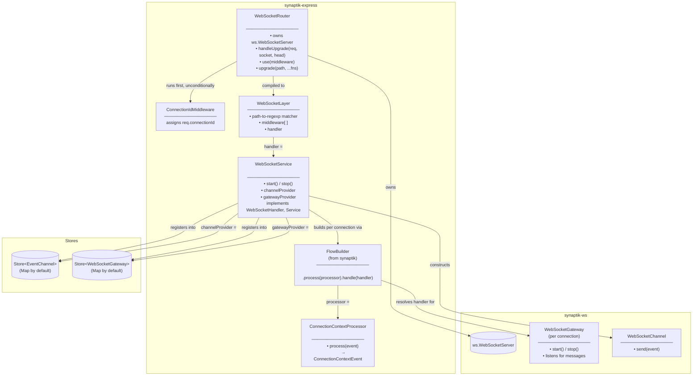
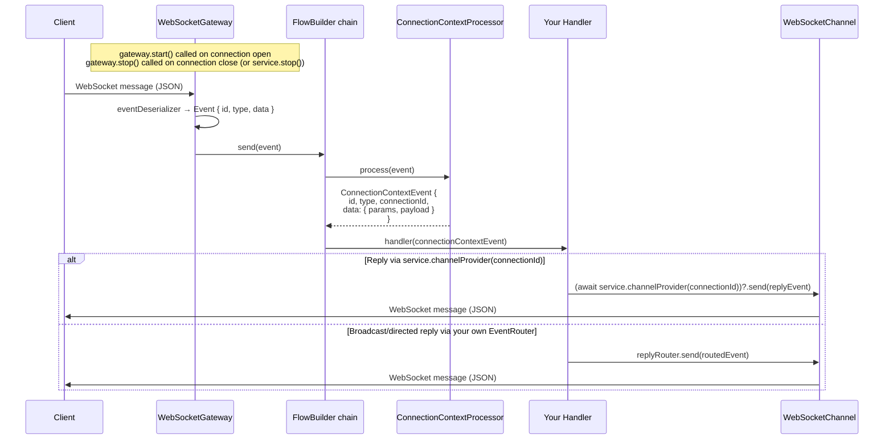

# WebSocket Transport

The WebSocket module provides a complete server-side WebSocket transport for `@sektek/synaptik-express`. It handles HTTP upgrade negotiation, connection lifecycle, URL-based routing, middleware, and event-driven message dispatch — all wired into the synaptik event pipeline.

The module is split along one deliberate seam: `WebSocketRouter` owns everything about the raw WebSocket connection (the upgrade handshake, URL routing, middleware, `connectionId` assignment) and has **no knowledge of Synaptik** — it's modeled on Express's `Router`, and is intended to be extractable into standalone WebSocket-for-Express utilities with no Synaptik dependency. `WebSocketService` is the bridge into Synaptik: it's a **connection registry** — for each connection it registers a `WebSocketChannel` (outbound) and a `WebSocketGateway` (inbound) pair, keyed by `connectionId`, and exposes a provider for each. It implements `Service` (`start()`/`stop()`) for clean shutdown of everything it owns.

---

## Architecture



---

## Connection Lifecycle

```mermaid
sequenceDiagram
    participant Client
    participant HTTPServer as http.Server
    participant Router as WebSocketRouter
    participant IdMw as ConnectionIdMiddleware
    participant Layer as WebSocketLayer
    participant Service as WebSocketService
    participant CStore as Store&lt;EventChannel&gt;
    participant GStore as Store&lt;WebSocketGateway&gt;

    Client->>HTTPServer: HTTP GET (Upgrade: websocket)

    alt { server } attach mode
        HTTPServer->>Router: internal upgrade handling
    else handleUpgrade() attach mode
        HTTPServer->>Router: handleUpgrade(req, socket, head)
    end

    Router->>IdMw: handle(ws, req, next)
    IdMw-->>Router: req.connectionId assigned
    Router-->>Router: emit CONNECTION_OPENED

    Router->>Router: parse pathname + query
    Router->>Layer: match layer, run middleware
    Layer->>Service: handle(ws, req)

    alt service not started
        Service-->>Client: close(GOING_AWAY)
    else service started
        Service->>CStore: set(connectionId, WebSocketChannel)
        Service->>GStore: set(connectionId, WebSocketGateway)
        Service-->>Service: emit CHANNEL_REGISTERED
        Note over Service: gateway dispatches inbound messages<br/>(see Message Flow below)
    end

    Note over Client,Service: connection is now active

    Client->>Router: close
    Router-->>Router: emit CONNECTION_CLOSED
    Service->>GStore: gateway.stop(), delete(connectionId)
    Service->>CStore: delete(connectionId)
    Service-->>Service: emit CHANNEL_UNREGISTERED
```

Note `CONNECTION_OPENED`/`CONNECTION_CLOSED` (router, transport-level) and `CHANNEL_REGISTERED`/`CHANNEL_UNREGISTERED` (service, store lifecycle) are distinct events on different emitters — the service's pair fires slightly later, once the channel/gateway pair is actually registered.

---

## Message Flow (`FlowBuilder`)

`WebSocketService` builds each connection's inbound handler chain using core's `FlowBuilder` — no bespoke composition class. `FlowBuilder.with(config)` is built once (constructor); `.process(processor).handle(handler).get()` is called fresh per connection, since each connection needs its own `ConnectionContextProcessor` (different `connectionId`/`params`).



There is no outbound routing helper built into `WebSocketService`. For a **single-connection reply**, resolve the channel directly:

```ts
await (await service.channelProvider(connectionId))?.send(replyEvent);
```

For **broadcast/directed routing** via an `EventRouter`, construct your own `Store<EventChannel>`, pass it in as `channelStore`, and build a `ConnectionChannelRoutesProvider` against that same store instance:

```ts
const channelStore = new Map<string, EventChannel>();
const service = new WebSocketService({ handler, channelStore });
const replyRouter = new EventRouter<RoutedEvent>({
  routesProvider: new ConnectionChannelRoutesProvider({
    channelStore,
    connectionDecider: event => event.connectionId ?? [],
  }),
});
```

`ConnectionChannelRoutesProvider` itself is unchanged — it just takes a `Store<EventChannel<T>>`, so this works with any store you construct and share.

---

## Routing

`WebSocketRouter` matches the URL path of the HTTP upgrade request — routing is per-connection, not per-message. Each connection is dispatched to exactly one handler. `connectionId` assignment always runs first, unconditionally, so it's available even when no route ends up matching.


---

## Service Lifecycle (`WebSocketService`)

`WebSocketService` implements utility-belt's `Service` (`start()`/`stop()`):

- **`start()`** must be called before `handle()` will register anything — a connection routed to a service that hasn't been started is closed immediately with `GOING_AWAY`. This matches every other Synaptik gateway (`AmqpGateway`, `BullMqGateway`, `WebSocketGateway`), which also require an explicit `start()`.
- **`stop()`** stops accepting new connections (same `GOING_AWAY` rejection as never-started) and cleanly tears down every connection the service currently owns: stops each `WebSocketGateway`, removes both store entries, and closes each socket with `GOING_AWAY`.

Per-connection teardown is idempotent — whether triggered by `stop()` or by the socket's own `close` event, a connection is only unregistered (and `CHANNEL_UNREGISTERED` only emitted) once.

---

## Component Reference

| Component | Package | Responsibility |
|-----------|---------|----------------|
| `WebSocketRouter` | synaptik-express | Owns the `ws.WebSocketServer`, accepts HTTP upgrades (`{ server }` attach or manual `handleUpgrade()`), assigns `connectionId`, and routes connections by URL path to a terminal `WebSocketHandlerComponent`. Has no Synaptik dependency. |
| `ConnectionIdMiddleware` | synaptik-express | Assigns `req.connectionId` via a pluggable `ConnectionIdProvider` (default: `randomUUID()`). Run by the router before routing, on every connection. |
| `WebSocketLayer` | synaptik-express | A compiled route: path-to-regexp matcher + middleware chain + terminal handler. |
| `WebSocketService` | synaptik-express | Connection registry bridging accepted connections into the Synaptik event pipeline. Implements `Service` (`start()`/`stop()`) and `WebSocketHandler`, so it's typically passed directly to `WebSocketRouter.upgrade()`. Exposes `channelProvider`/`gatewayProvider`. |
| `ConnectionContextProcessor` | synaptik-express | Wraps an incoming `Event` in a `ConnectionContextEvent` via `EventBuilder`, preserving `id`/`type`/`parentId`/`replyTo`, injecting `connectionId` into the event headers, and setting `data` to `{ params, payload }` (the original event data). |
| `ConnectionChannelRoutesProvider` | synaptik-express | Implements synaptik's `RoutesProvider<T>`. Resolves one or more `EventChannel`s from an event via an optional `ConnectionDecider` (directed delivery), or every registered channel (broadcast). Construct it yourself against a `Store<EventChannel>` you also pass to `WebSocketService` as `channelStore`; pair with `EventRouter` from `@sektek/synaptik`. |
| `FlowBuilder` | synaptik | Composes the per-connection processor → handler chain (`.process(processor).handle(handler)`). Used directly by `WebSocketService` — no bespoke composition class in this module. |
| `WebSocketGateway` | synaptik-ws | Attaches a message listener to a single `WebSocketLike`. Deserialises messages, forwards to a handler. One instance per connection, tracked in `WebSocketService`'s gateway store and resolvable via `gatewayProvider`. |
| `WebSocketChannel` | synaptik-ws | Serialises and sends an `Event` to a single `WebSocketLike`. One instance per connection, tracked in `WebSocketService`'s channel store and resolvable via `channelProvider`. |

---

## Close Codes

| Code | Constant | When used |
|------|----------|-----------|
| 1001 | `GOING_AWAY` | `WebSocketService.handle()` called before `start()` (or after `stop()`); also used by `stop()` itself to close every owned connection |
| 1008 | `POLICY_VIOLATION` | Middleware called `next(err)` |
| 1011 | `INTERNAL_SERVER_ERROR` | `connectionIdProvider`, handler, or connection setup threw |
| 4004 | `ROUTE_NOT_FOUND` | No registered route matched the path |
