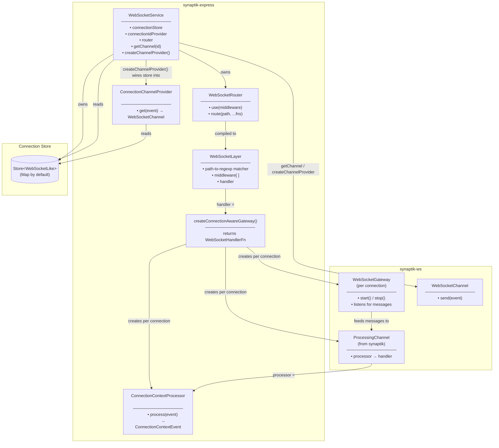
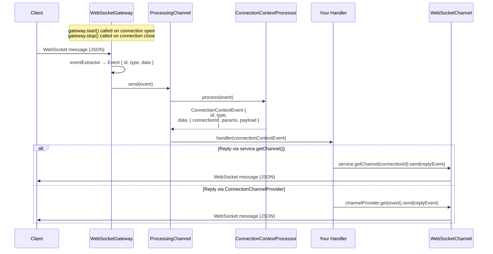
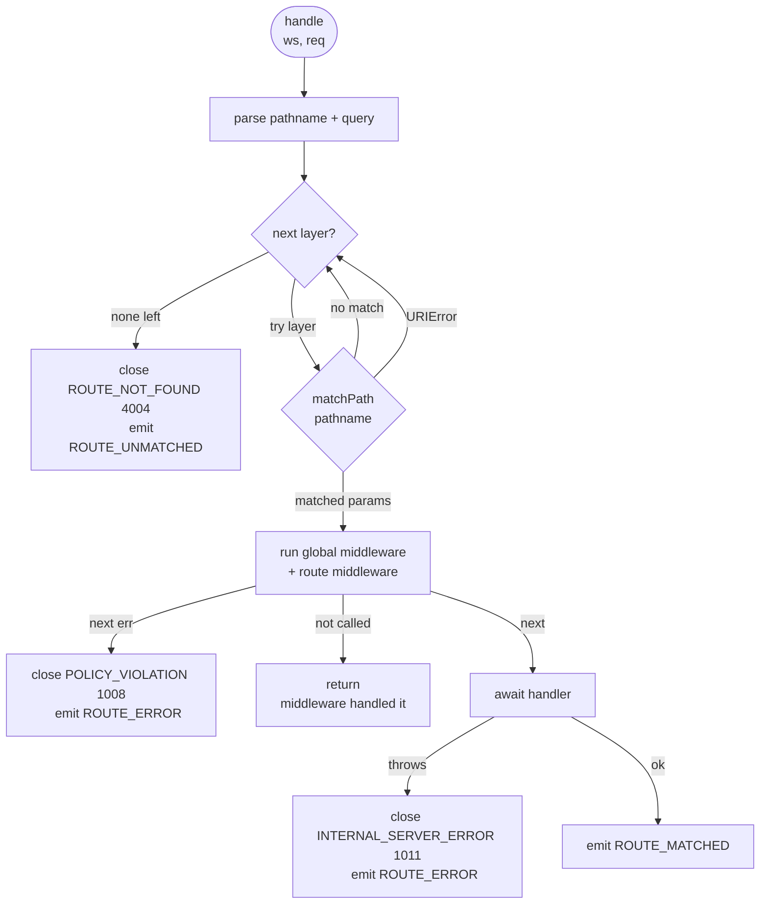

# WebSocket Transport

The WebSocket module provides a complete server-side WebSocket transport for `@sektek/synaptik-express`. It handles HTTP upgrade negotiation, connection lifecycle, URL-based routing, middleware, and event-driven message dispatch — all wired into the synaptik event pipeline.

---

## Architecture



---

## Connection Lifecycle

```mermaid
sequenceDiagram
    participant Client
    participant HTTPServer as http.Server
    participant Service as WebSocketService
    participant IdProvider as ConnectionIdProvider
    participant Store as Store&lt;WebSocketLike&gt;
    participant Router as WebSocketRouter
    participant Handler as WebSocketHandlerFn

    Client->>HTTPServer: HTTP GET (Upgrade: websocket)

    alt { server } attach mode
        HTTPServer->>Service: internal upgrade handling
    else handleUpgrade() attach mode
        HTTPServer->>Service: handleUpgrade(req, socket, head)
    end

    Service->>IdProvider: get(ws, req) → connectionId
    Service->>Store: set(connectionId, ws)
    Service-->>Service: emit CONNECTION_OPENED

    Service->>Router: handle(ws, req)
    Router->>Router: parse pathname + query
    Router->>Router: match layer, run middleware
    Router->>Handler: handler(ws, req)
    Note over Handler: sets up per-connection gateway<br/>(see Message Flow below)

    Note over Client,Handler: connection is now active

    Client->>Service: close
    Service->>Store: await delete(connectionId)
    Service-->>Service: emit CONNECTION_CLOSED
```

---

## Message Flow (with `createConnectionAwareGateway`)

`createConnectionAwareGateway` is the standard route handler. It composes a `WebSocketGateway`, `ConnectionContextProcessor`, and `ProcessingChannel` per connection to turn raw WebSocket messages into typed `ConnectionContextEvent` objects delivered to your handler.



---

## Routing

`WebSocketRouter` matches the URL path of the HTTP upgrade request — routing is per-connection, not per-message. Each connection is dispatched to exactly one handler.



---

## Component Reference

| Component | Package | Responsibility |
|-----------|---------|----------------|
| `WebSocketService` | synaptik-express | Owns the WebSocket server, connection store, and router. Entry point for the whole system. |
| `WebSocketRouter` | synaptik-express | Routes upgrade requests by URL path. Manages global middleware and route layers. |
| `WebSocketLayer` | synaptik-express | A compiled route: path-to-regexp matcher + middleware chain + terminal handler. |
| `ConnectionIdProvider` | synaptik-express | Derives a stable string ID for each connection (default: `randomUUID()`). |
| `createConnectionAwareGateway` | synaptik-express | Factory that returns a `WebSocketHandlerFn` composing a per-connection gateway, processor, and processing channel. |
| `ConnectionContextProcessor` | synaptik-express | Wraps an incoming `Event` in a `ConnectionContextEvent`, injecting `connectionId`, `params`, and the original data as `payload`. |
| `ConnectionChannelProvider` | synaptik-express | Resolves a `WebSocketChannel` from a `ConnectionContextEvent` by looking up `connectionId` in the store. Obtain via `service.createChannelProvider()`. |
| `WebSocketGateway` | synaptik-ws | Attaches a message listener to a single `WebSocketLike`. Extracts and deserialises messages, forwards to a handler. |
| `WebSocketChannel` | synaptik-ws | Serialises and sends an `Event` to a single `WebSocketLike`. |
| `ProcessingChannel` | synaptik | Chains a processor and a handler: `processor.process(event)` then `handler(result)`. |

---

## Close Codes

| Code | Constant | When used |
|------|----------|-----------|
| 1008 | `POLICY_VIOLATION` | Middleware called `next(err)` |
| 1011 | `INTERNAL_SERVER_ERROR` | Handler or connection setup threw |
| 4004 | `ROUTE_NOT_FOUND` | No registered route matched the path |
